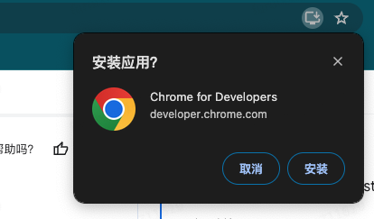

### Progressive Web App(PWA)

其实pwa技术已经出来很久了，它的中文名字叫<B>**渐进式网页应用**</B>, 自己也是很早以前就想总结一下具体的步骤，无奈一直没有时间，最近正好年后来了，工作没有那么忙，就想着总结一下。

关于PWA的详细介绍，和实现原理这里不做过多的赘述，直接上干活，让你在10分钟内，将自己的项目转成成PWA项目。

这里已vue-cli为例（因为我的项目是一个老项目），

1. 安装pwa插件（@vue/cli-plugin-pwa）
   
   ```bash
   vue add @vue/cli-plugin-pwa@4.5.17
   ```
   
   > 我的项目比较旧，所以使用了4.5.17版本，如果是新的项目可以使用最新的版本，如果是vite构建的项目可以使用（[vite的pwa插件](https://github.com/vite-pwa/vite-plugin-pwa)），如果你的项目是webpack([webpack的pwa插件](https://webpack.docschina.org/guides/progressive-web-application/))
   
   安装完成之后，你的package.json里面会多如下两个依赖
   
   ```json
   // package.json
   {
       "dependencies": {
           "register-service-worker": "^1.7.2",
           ...
       },
       "devDependencies": {
           "@vue/cli-plugin-pwa": "^4.5.17",
           ...
       }
   }
   ```

2. 配置插件（vue.config.js）
   
   ```javascript
   module.exports = {
     ...,
     pwa: {
       name: '网站名字',
       themeColor: '#15161f',
       msTileColor: '#000000',
       appleMobileWebAppCapable: 'yes',
       appleMobileWebAppStatusBarStyle: 'black',
       workboxPluginMode: 'InjectManifest',
       workboxOptions: {
         importScripts: ['https://storage.googleapis.com/workbox-cdn/releases/6.4.1/workbox-sw.js'],
         exclude: [/\.html$/],//html不进行service Worker缓存
         // 自定义 Service Worker 文件的位置
         swSrc: 'src/service-worker.js'
       },
       manifestOptions: {
         icons: [ 
           // 这里配置网站的icon，需要将icon放到public目录下面的img目录下的icons目录下
           // 这里的目录名不固定，可以自定义
           {
             src: 'img/icons/logo-192.png',
             sizes: '192x152',
             type: 'image/png'
           },
           {
             src: 'img/icons/logo-512.png',
             sizes: '512x512',
             type: 'image/png'
           },
         ]
       }
     },
     ...
   };
   ```
   
   > 注意这里配置插件需要看对应版本的配置，不同的插件版本对应的配置项可能不一样

3. 注册serviceWorker（在src目录下面新建registerServiceWorker.js,并在这个main.js引入这个js，这个文件应该是自动生成，如果没有生成可以手动生成并配置如下内容）
   
   ```js
   // registerServiceWorker.js
   import { register } from 'register-service-worker';
   
   if (process.env.NODE_ENV === 'production') {
     register(`${window.location.origin}/service-worker.js`, {
       ready() {
         console.log('App is being served from cache by a service worker.');
       },
       registered() {
         console.log('Service worker has been registered.');
       },
       cached() {
         console.log('Content has been cached for offline use.');
       },
       updatefound() {
         console.log('New content is downloading.');
       },
       updated() {
         console.log('New content is available; please refresh.');
       },
       offline() {
         console.log('No internet connection found. App is running in offline mode.');
       },
       error(error) {
         console.error('Error during service worker registration:', error);
       },
     });
   }
   ```
   
   在main.js里面引入上面的文件（*如果vue.config.js里面配置了swSrc,这里不引入也没关系，打包的时候，会自动引入*）
   
   ```javascript
   // main.js
   import './registerServiceWorker'
   ```

4. 配置service-worker缓存静态资源(src目录下面新建service-worker.js)
   
   ```javascript
   // service-worker.js
   workbox.core.setCacheNameDetails({
     prefix: 'my-app',
     suffix: 'v1.0.0',
   });
   workbox.core.skipWaiting(); // 强制等待中的 Service Worker 被激活
   workbox.core.clientsClaim(); // Service Worker 被激活后使其立即获得页面控制权
   // eslint-disable-next-line
   workbox.precaching.precacheAndRoute(self.__precacheManifest || []); // 设置预加载
   
   // 缓存web的css资源
   workbox.routing.registerRoute(
     // Cache CSS files
     /.*\.css/,
     // 使用缓存，但尽快在后台更新
     new workbox.strategies.StaleWhileRevalidate({
       // 使用自定义缓存名称
       cacheName: 'css-cache',
     }),
   );
   
   // 缓存web的js资源
   workbox.routing.registerRoute(
     // 缓存JS文件
     /.*\.js/,
     // 使用缓存，但尽快在后台更新
     new workbox.strategies.StaleWhileRevalidate({
       // 使用自定义缓存名称
       cacheName: 'js-cache',
     }),
   );
   
   // 缓存web的图片资源
   workbox.routing.registerRoute(
     /\.(?:png|gif|jpg|jpeg|svg)$/,
     new workbox.strategies.StaleWhileRevalidate({
       cacheName: 'images',
       plugins: [
         new workbox.expiration.ExpirationPlugin({
           maxEntries: 60,
           maxAgeSeconds: 30 * 24 * 60 * 60, // 设置缓存有效期为30天
         }),
       ],
     }),
   );
   ```
   
   > 更多的配置请参考（[workbox配置]([Workbox 的方式 &nbsp;|&nbsp; Chrome for Developers](https://developer.chrome.com/docs/workbox/the-ways-of-workbox?hl=zh-cn))）

5. 打包部署

6. 在你的浏览器访问页面url就出现如下图标,点击安装就可以了
   


7. 如果想查看你安装了安歇pwa，可以在chrome地址栏输入chrome://apps,可以对你的pwa进行管理


