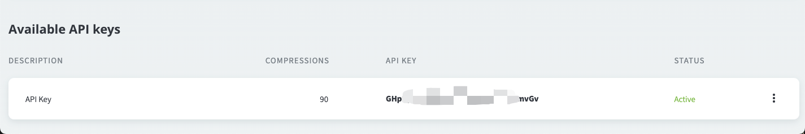

前几天做大促的项目，每次UI更新图片我们都要手动上传到tinypng网站去压缩，然后再把压缩后的图片上传到我们的cdn上，作为一个有追求的程序猿，怎么能忍受手动这个词，So，空闲时间做了一个cli，简单做一下使用方法（欢迎star）:

[github地址]([github](https://github.com/frxing/tiny))

[gitee地址]([gitee](https://gitee.com/btoa/tiny))

### 使用方法

**安装**

```bash
 npm install -g @frxing/tiny
```
> 此时全局就多了3个命令：tiny 、ty 、ti。三个命令相同，ti/ty只是简写形式

**使用**
1. 注册tinypng的apikey。
   
   

2. 添加apikey
  
  ```bash
   ty addKey ***************
  ```
3. 进入图片目录，右键从终端打开（macOs: 右键-服务-新建位于文件夹位置的终端标签页）。
  
  ```bash
   # 压缩整个文件夹里面的图片
   ty 

   # 压缩某一张图片
   ty ./*.png

   # 压缩某个目录
   ty */*
  ```

4. 压缩完成后会在文件的同级多了一个dest目录存放压缩后的图片
   
### 搭建过程

> 主要写一下vite的配置，其它的内容使用pnpm初始化vite项目的时候默认配置就可以

```javascript
 // vite.config.mts
 
  import { defineConfig, Plugin } from 'vite'
  import { resolve} from 'path';
  import { nodeExternals } from 'rollup-plugin-node-externals'

  function externals(): Plugin {
    return {
      ...nodeExternals(),
      name: 'node-externals',
      enforce: 'pre', // 关键是要在 vite 默认的依赖解析插件之前运行
      apply: 'build',
    }
  }

  export default defineConfig({
    plugins: [
      externals()
    ],
    resolve: {
      alias: {
        '@': resolve(__dirname, 'src')
      },
      // 修改解析方式默认为 node 而非 browser
      mainFields: ['module', 'jsnext:main', 'jsnext'],
      conditions: ['node'],
    },
    build: {
      outDir: 'bin',// 如果你不需要压缩代码，可以设为 false
      lib: {
        entry: resolve(__dirname, 'src/main.mts'),
        formats: ['cjs'],
        fileName: () => {
          return  `ty.min.js`
        },
      },
      minify: 'terser',
      rollupOptions: {
        // 确保外部化处理那些
        // 你不想打包进库的依赖
        external: ['tinify']
      }
    },
  })


```
